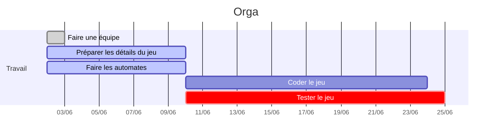

# GPI & PLA : Le Patatruck

 

[UML & Doc technique interne](https://md.edgar.bzh/s/LQ3jRvNxH#)

Concept de base: un food-truck qui cuisine ses plats pendant qu'il se rend sur le lieu de livraison. Un joueur s'occupe de cuisiner les plats tandis que le second conduit le véhicule. L'aggressivité de la conduite peut se faire sentir dans la cuisine tandis que les erreurs en cuisine auront des répercussions sur le conduite.

La cuisine en question https://www.youtube.com/watch?v=LgOyYzm33dw

_Illustration conceptuelle: la cuisine manque et les compteurs de part et d'autre du camion pourraient changer_

## Contraintes du projet

  * Deux joueurs: un conducteur, un cuisinier
  * Deux mondes avec des physiques différentes: la ville vue de haut en plan large avec une physique de conduite (inertie, accélération), la cuisine du camion (mouvements basiques sur une grille)
      * Des mondes qui intéragissent: le camion ramasse des ingrédients sur la route, l'accélération du camion (positive ou négative) peut pénaliser la cuisine
  * Des entités qui pululent: des cafards dans la cuisine (rare, mais ennuyeux), des piétons, des voitures dans la ville
  * Un des mondes est infini: la ville est générée procéduralement

## Ingrédients / Recettes

## Scoring / conditions de fin

* 2 minutes de temps au début
* Une commande livrée = rajoute du temps
* Score = temps que l'on réussit à survivre
* Game over si timer arrive à 0 +

## Plan du patatruck (cuisine)

**Tables à sauce :** Contient de la sauce qu'on considère en quantité illimitée
**Ingrédients :** Contient un type d'ingrédient qu'on possède en quantité limitée. On peut ramasser les ingrédients sur la route
**Planches à découper :** Permet de découper certains ingrédients qui peuvent être découpés (patates, tomates, pain)
**Friteuses :** Permet de faire frire les patates découpées
**Feux de cuisson :** Permet de faire cuire la viande et les patates découpées
**Poubelle :** Permet de jeter un ingrédient (en cas d'erreur par exemple)
**Tables :** Permet de déposer un ingrédient dessus
**Livraison :** On peut déposer n'importe quel item sur chaque bac à livraison. Le camion se trouve à l'endroit de livraison prévu, les ingrédients disparaissent et la recette est validée, on en obtient une nouvelle

https://docs.google.com/spreadsheets/d/1Ua8SwKIQYQbvkAa6IYdM2cNQfL4THITyxEKHs4Gwb-M/edit?usp=sharing

##  Tuiles de route

Générées procéduralement. Viewport centré sur le camion. La grille est une alternance de cellules 11x11 et 9x9 en diagonale (avec des cellules 9x11 et 11x9 qui les relient).

  * Les cellules 11x11 correspondent forcément à un bâtiment, et sont donc forcément pleines.
  * Les cellules dont un côté fait 9 pixels et l'autre 11 correspondent où bien à des routes, ou bien à des connexions entre deux bâtiments (pour former un bâtiment plus grand). Leur état est déterminé par le générateur procédural.
  * Les cellules 9x9 correspondent à des croisement entre des routes, ou bien à des connexions entre des bâtiments si les 4 cellules l'entourant sont également des connexions entre des bâtiments. Leur état est donc dérivé.

Pour résumer, seul l'état des cellules 9x11 et 11x9 a besoin d'être généré, les états des autres cellules sont constants ou dérivés. L'algorithme de génération est en cours de conception.

Eléments de la ville :

  * Bâtiments (alignés sur la grille) :
      * Carré 1x1
      * Carré 2x2
      * Ligne droite 2x1 (vertical & horizontal)
      * Ligne droite 3x1 (vertical & horizontal)
      * "L" 2x2 (bas-droite, bas-gauche, haut-gauche, haut-droite)
      * _Certains ont plusieurs variantes visuelles_
  * Entités
      * Plots de signalisation
      * Etals de marché : donnent des resources lors d'une collision avec un véhicule
      * Ralentisseurs : mélange les items dans le camion
      * Verglas : change la physique du camion
      * Nid de poule : échange le conducteur et le cuisinier
      * Si ralentisseur trop rapide + item par terre dans camion : impacte la vision de la route

## Automates/entités dans le camion

[💬 Sémantique du langage](https://gricad-gitlab.univ-grenoble-alpes.fr/PROJET_INFO3/projet/-/blob/master/gal/SEMANTIQUE.md)

### Fonctionnement des automates chez nous

Exécution des branches d'action dans l'ordre jusqu'à ce qu'une d'entre elle matche. Les actions renvoient des booléens qui, s'ils valent false, font passer à l'action suivante.

Voir l'UML pour la structure créée.

## Effet de la cuisine sur la conduite = Doublure

Chaque erreur sur la cuisson aura un impact sur la conduite = on change le stunt associé à l'entité camion
  * Erreur de friture : flaque d'huile donc plus de freins
  * Erreur sur la cuisson de la viande : fumée donc obligé d'aller doucement (ralentit)

## Planning

