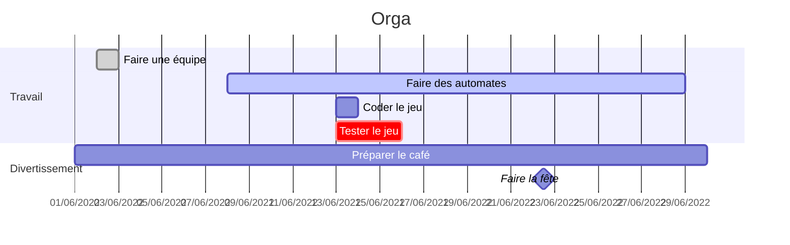

# GPI & PLA : Le patatruck

[](https://gricad-gitlab.univ-grenoble-alpes.fr/PROJET_INFO3/G1/patatruck)

Concept de base: un food-truck qui cuisine ses plats pendant qu'il se rend sur le lieu de livraison. Un joueur s'occupe de cuisiner les plats tandis que le second conduit le véhicule. L'aggressivité de la conduite peut se faire sentir dans la cuisine tandis que les erreurs en cuisine auront des répercussions sur le conduite.

La cuisine en question https://www.youtube.com/watch?v=LgOyYzm33dw


_Illustration conceptuelle: la cuisine manque et les compteurs de part et d'autre du camion pourraient changer_

## Contraintes du projet

  * Deux joueurs: un conducteur, un cuisinier
  * Deux mondes avec des physiques différentes: la ville vue de haut en plan large avec une physique de conduite (inertie, accélération), la cuisine du camion (mouvements basiques sur une grille)
      * Des mondes qui intéragissent: le camion ramasse des ingrédients sur la route, l'accélération du camion (positive ou négative) peut pénaliser la cuisine
  * Des entités qui pululent: des cafards dans la cuisine (rare, mais ennuyeux), des piétons, des voitures dans la ville
  * Un des mondes est infini: la ville est générée procéduralement

## Ingrédients / Recettes


## Scoring / conditions de fin

* 3 minutes de temps au début
* Une commande livrée = rajoute du temps
* Score = temps que l'on réussit à survivre
* Game over si timer arrive à 0 +

## Plan du patatruck (cuisine)


**Tables à sauce :** Contient de la sauce qu'on considère en quantité illimitée
**Ingrédients :** Contient un type d'ingrédient qu'on possède en quantité limitée. On peut ramasser les ingrédients sur la route
**Planches à découper :** Permet de découper certains ingrédients qui peuvent être découpés (patates, tomates, pain)
**Friteuses :** Permet de faire frire les patates découpées
**Feux de cuisson :** Permet de faire cuire la viande et les patates découpées
**Poubelle :** Permet de jeter un ingrédient (en cas d'erreur par exemple)
**Tables :** Permet de déposer un ingrédient dessus
**Livraison :** On peut déposer n'importe quel item sur chaque bac à livraison. Le camion se trouve à l'endroit de livraison prévu, les ingrédients disparaissent et la recette est validée, on en obtient une nouvelle

https://docs.google.com/spreadsheets/d/1Ua8SwKIQYQbvkAa6IYdM2cNQfL4THITyxEKHs4Gwb-M/edit?usp=sharing

##  Tuiles de route

Générées procéduralement. Viewport centré sur le camion. La grille est une alternance de cellules 11x11 et 9x9 en diagonale (avec des cellules 9x11 et 11x9 qui les relient).

  * Les cellules 11x11 correspondent forcément à un bâtiment, et sont donc forcément pleines.
  * Les cellules dont un côté fait 9 pixels et l'autre 11 correspondent où bien à des routes, ou bien à des connexions entre deux bâtiments (pour former un bâtiment plus grand). Leur état est déterminé par le générateur procédural.
  * Les cellules 9x9 correspondent à des croisement entre des routes, ou bien à des connexions entre des bâtiments si les 4 cellules l'entourant sont également des connexions entre des bâtiments. Leur état est donc dérivé.

Pour résumer, seul l'état des cellules 9x11 et 11x9 a besoin d'être généré, les états des autres cellules sont constants ou dérivés. L'algorithme de génération est en cours de conception.

Eléments de la ville :

  * Bâtiments (alignés sur la grille) :
      * Carré 1x1
      * Carré 2x2
      * Ligne droite 2x1 (vertical & horizontal)
      * Ligne droite 3x1 (vertical & horizontal)
      * "L" 2x2 (bas-droite, bas-gauche, haut-gauche, haut-droite)
      * _Certains ont plusieurs variantes visuelles_
  * Entités
      * Plots de signalisation
      * Etals de marché : donnent des resources lors d'une collision avec un véhicule
      * Ralentisseurs : mélange les items dans le camion
      * Verglas : change la physique du camion
      * Nid de poule : échange le conducteur et le cuisinier
      * Si ralentisseur trop rapide + item par terre dans camion : impacte la vision de la route

## Automates/entités dans le camion

[💬 Sémantique du langage](https://gricad-gitlab.univ-grenoble-alpes.fr/PROJET_INFO3/projet/-/blob/master/gal/SEMANTIQUE.md)

#### Cafards
``` haskell
Cafard(DeplacementN){
 * (DeplacementN): 						
 | Cell(H,@) 	? Explode() :()				//Le cafard regarde si le joueur est sur sa case, si oui il meurt
 | Cell(N,@) 	? :(DeplacementS)				//Le cafard regarde si le joueur est sur la case nord, si oui il se déplace vers le sud pour l'éviter
 | Cell(H,P)	? 4%Pick(H) / 48%Pop / 48%Wizz  :(_)		//Le cafard regarde si la case actuelle contient un pickable, si oui il a 4% de chances de le prendre
 | Cell(N,V/A)	? Move(N) :(_)					//Le cafard regarde si la case nord est vide ou possède un cafard, il se déplace vers le nord
 | True      	? Turn(S) :(_)					//Dans ce cas là, le cafard ne pourra pas avancer vers le nord et se tourne vers le sud
 
 * (DeplacementS): 
 | Cell(S,@) 	? Explode() :()				//Le cafard regarde si le joueur est sur sa case, si oui il meurt
 | Cell(S,@)	? :(DeplacementN)				//Le cafard regarde si le joueur est sur la case sud, si oui il se déplace vers le nord pour l'éviter
 | Cell(H,P)	? 4%Pick(H) / 48%Pop / 48%Wizz  :(_)		//Le cafard regarde si la case actuelle contient un pickable, si oui il a 4% de chances de le prendre
 | Cell(S,V/A)	? Move(S) :(_)					//Le cafard regarde si la case sud est vide ou possède un cafard, si oui il se déplace vers le sud
 | True      	? Turn(N) :(_)					//Dans ce cas là, le cafard ne pourra pas avancer vers le sud et se tourne vers le nord
 
 * (DeplacementE): 
 | Cell(H,@)	? Explode() :()				//Le cafard regarde si le joueur est sur sa case, si oui il meurt
 | Cell(E,@)	? :(DeplacementR)				//Le cafard regarde si le joueur est sur la case Est, si oui il se déplace vers l'ouest pour l'éviter
 | Cell(H,P)	? 4%Pick(H) / 48%Pop / 48%Wizz  :(_)		//Le cafard regarde si la case actuelle contient un pickable, si oui il a 4% de chances de le prendre
 | Cell(E,V/A)	? Move(E) :(_)					//Le cafard regarde si la case Est est vide ou possède un cafard, si oui il se déplace vers l'est
 | True    	? Turn(W) :(_)					//Dans ce cas là, le cafard ne pourra pas avancer vers l'Est et se tourne vers l'ouest
 
 * (DeplacementW): 
 | Cell(H,@)	? Explode() :()				//Le cafard regarde si le joueur est sur sa case, si oui il meurt
 | Cell(W,@)	? :(DeplacementL)				//Le cafard regarde si le joueur est sur la case ouest, si oui il se déplace vers l'Est pour l'éviter
 | Cell(H,P)	? 4%Pick(H) / 48%Pop / 48%Wizz  :(_)		//Le cafard regarde si la case actuelle contient un pickable, si oui il a 4% de chances de le prendre
 | Cell(W,V/A)	? Move(W) :(_)					//Le cafard regarde si la case ouest est vide ou possède un cafard, si oui il se déplace vers l'ouest
 | True     	? Turn(E) :(_)					//Dans ce cas là, le cafard ne pourra pas avancer vers l'ouest et se tourne vers l'Est
 
 * (Dupplication): 
 | True ? 10%Egg(H) / 40%Pop / 40%Wizz :(_)			//Le cafard à 10% de chances de se duppliquer, sinon il fait des annimations graphiques
  
 * ()
 }
 Pop et Wizz sont des animations graphiques
```
#### Equipement cuisine 

```haskell
Feu_cuisson(wait){
    *(wait)
    |Cell(H,P) ? Pop:(cook)            //Si un objet pickable est sur la même case, un Pop va afficher un sprite en mode "feu allumé"
    |Cell(H,V) ?    :(wait)            //Si il n'y a aucune objet sur la même case, on attends
    
    *(cook)
    |True ?     wait:(cuit)            //On effectue un wait, ce qui correspond au temps de cuisson

    *(cuit)
    |Cell(H,P) ?    :(cuit)            //Tant que l'élément pickable est encore présent, on boucle sur cet état
    |Cell(H,V) ?    Wizz:(wait)        //Si l'élément n'est plus présent, le Wizz va afficher un sprite en mode "feu éteint"
}

Friteuse(wait){
    *(wait)
    |Cell(H,P) ? Pop:(cook)            //Si un objet pickable est sur la même case, un Pop va afficher un sprite en mode "huile chaude"
    |Cell(H,V) ?    :(wait)            //Si il n'y a aucune objet sur la même case, on attends
    
    *(cook)
    |True ?     wait:(cuit)            //On effectue un wait, ce qui correspond au temps de cuisson

    *(cuit)
    |Cell(H,P) ?    :(cuit)            //Tant que l'élément pickable est encore présent, on boucle sur cet état
    |Cell(H,V) ?    Wizz:(wait)        //Si l'élément n'est plus présent, le Wizz va afficher un sprite en mode "huile froide"
}

Garde_manger(wait){
    *(wait)
    |Cell(H,V) & GotStuff ?    Wizz:(waitRestock)    //Si la cellule est vide et qu'il reste du stuff on passe dans l'état restock qui va remettre un item sur le présentoire du garde manger
    |True ?    :(wait)                               //rien dans l'inventaire du G_m
    
    *(waitRestock)                        
    |True ? wait:(restock)                           //tps d'attente avant de pouvoir repick un item
    
    *(restock)                     
    |True ? Pop:(wait)                               //On repasse dans l'état wait avec un Pop qui affiche un item sur le présentoire
}

Table(vide){
    *(vide)
    |Cell(H,P) ? Pop:(pleine)        //Si pickable here => état pleine, Pop changement de sprite mode "table pleine"
    |Cell(H,V) ?    :(vide)         //Si void here => état vide
    
    *(pleine)
    |Cell(H,P) ?    :(pleine)        //Si pickable here => état pleine
    |Cell(H,V) ? Wizz:(vide)        //Si void here => état vide, Wizz changement de sprite mode "table vide"
}

Table_a_sauce(ready){
    *(ready)
    |GotPower ? Wizz:(waitRestock)    //S'il y a une interaction, Wizz changement de sprite mode "reload"
    |True ?   :(ready)               //Sinon on reste dans l'état ready
        
    *(waitRestock)                        
    |True ? wait:(restock)          //tps d'attente avant le reload
    
    *(restock)                     
    |True ? Pop:(ready)             //On repasse dans l'état ready avec un Pop changement de sprite mode "table ready"
}
GotPower sera implémenté comme ceci
True=>interaction
False=>!interaction

Planche(vide){
    *(vide)
    |Cell(H,P) ? Pop:(startCoupe)                             //S'il y a un élément pickable on passe dans l'état startCoupe
    |Cell(H,V) ?    :(vide)                                   //S'il n'y a pas d'item on boucle dans l'état vide
    
    *(startCoupe)
    |Cell(H,P) & Key(SPACE) & Cell(F,@) ? Hit: (couper1)       //Si l'élément pickable est toujours présent, que le joueur est en face de la planche et qu'il appuye sur la touche ESPACE, on compte une découpe
    |True ?    :(startCoupe)                                   //Boucle sur l'état actuel si le joueur ne découpe pas
    
    *(couper1)
    |Cell(H,P) & Key(SPACE) & Cell(F,@) ? Hit: (couper2)       //Si l'élément pickable est toujours présent, que le joueur est en face de la planche et qu'il appuye sur la touche ESPACE, on compte une découpe supplémentaire
    |True ?    :(couper1)                                      //Boucle sur l'état actuel si le joueur ne découpe pas
    
    *(couper2)
    |Cell(H,P) & Key(SPACE) & Cell(F,@) ? Hit: (couper)        //Si l'élément pickable est toujours présent, que le joueur est en face de la planche et qu'il appuye sur la touche ESPACE, on compte une découpe supplémentaire
    |True ?    :(couper2)                                      //Boucle sur l'état actuel si le joueur ne découpe pas
    
    *(couper)
    |Cell(H,V) ? Wizz:(vide)                                   //L'élement à fini d'être découpé, on repasse dans l'état vide
    |True ?    :(couper)                                      //Tant que le joueur ne récupère pas l'élément, on boucle dans cet état
}

Livraison(vide){
    *(vide)
    |Cell(H,P) ? Pop:(pret) // si on detecte un pickable dessus, on passe en plein
    |Cell(H,V) ?    :(vide) // sinon on attends
    
    *(pret)
    |Cell(H,P) ? Wizz:(vide) // c'est bon on supprime l'élément
    |True ?          :(vide)
}

```

#### Cuisinier
```haskell
Cook(Init){
  * (Init):
  | Key(Z) ? Wizz(N):(Init)
  | Key(Q) ? Wizz(E):(Init)
  | Key(S) ? Wizz(O):(Init)
  | Key(D) ? Wizz(S):(Init)
  | Key(SPACE) ? Pop(F):(Init)  
}
```
## Automates/entités sur la route

#### Camion

```haskell
Truck(Init){
  * (Init):
  | Key(FU) ? Wizz(N):(Init)
  | Key(FD) ? Wizz(S):(Init)
  | Key(FL) ? Wizz(O):(Init)
  | Key(FR) ? Wizz(E):(Init)
  | Key(ENTER) ? Pop(F):(Init)
}
```

#### Voitures
```haskell
Voiture(Drive) { -- Route : Jumpable; Croisement : Gate; Autre : Obstacle
    * (Drive) 
    | Cell(_,@) ? Pop :(Stop) -- Contact avec le camion => Stop
    | Cell(F,O) & Cell(R,J) ? Move(R) :(Roule) -- Mur devant + libre à droite 
                                               -- => droite
    | Cell(F,O) & Cell(L,J) ? Move(L) :(Roule) -- Mur devant + libre à gauche 
                                               -- => gauche
    | Cell(H,G) ? 10%Move(R) / 10%Move(L) / Move(F) :(Roule) -- Croisement
    | True ? Move(F) :(Roule) -- Avancer

    * (Stop) 
    | Cell(_,@) ? :(Stop)  -- Contact avec le camion => Stop
    | True ? Wizz :(Roule) -- Plus de contact => Drive
}
```
#### Stand de marché 

```haskell
Marché(Still){
  * (Still) 
  | Cell(_,@) ? Pop  :()
  | True ? Wizz :(Still)
  * ()
}
```

#### Cône de signalisation autour du marché
```haskell
TrafficCone(Still) {
  * (Still):
  | Cell(H,_) ? Pop :()
  | True ? Wizz :(Still)
  * ()
}
```
<BLOCKQUOTE>
Le cone ne fait rien mais se détruit s'il touche une autre entité.
</BLOCKQUOTE>

#### Ralentisseur

```haskell
SpeedBump(Still) {
    * (Still):
    | Cell(H,@) ? Pop :(Still) //verif si joueur passé trop vite
    | True ? Wizz :(Still) //nothing
}
```

#### Nid de poule

```haskell
Pothole(Still) {
    * (Still):
    | Cell(H,@) ? Pop :(Still) //verif si joueur passé dessus
    | True ? Wizz :(Still) //nothing
}
```

#### Verglas

```haskell
Iced_road(Still) {
    * (Still):
    | Cell(H,@) ? Pop :(Still) //verif si joueur passé dessus
    | True ? Wizz :(Still) //nothing
}
```

#### (Piéton ?)

:::info
BONUS
:::

## Effet de la cuisine sur la conduite = Doublure

Chaque erreur sur la cuisson aura un impact sur la conduite = on change le stunt associé à l'entité camion 
* Erreur de friture : flaque d'huile donc plus de freins
* Erreur sur la cuisson de la viande : fumée donc obligé d'aller doucement (ralentit)

## Planning



## Journal

## 4-7 juin

  * Travail sur le diagramme UML
  * Choix du concept et début conception

## 7 juin

Travail personnel :
  * Réflexion sur le contenu du jeu
      * Cuisine
      * Hitboxes et collisions
  * Ecriture de plusieurs automates pour prendre de l'avance et se familiariser avec la syntaxe
  * Mise en place du dépôt
  * Rédaction du README

En groupe: Election du chef d'équipe
